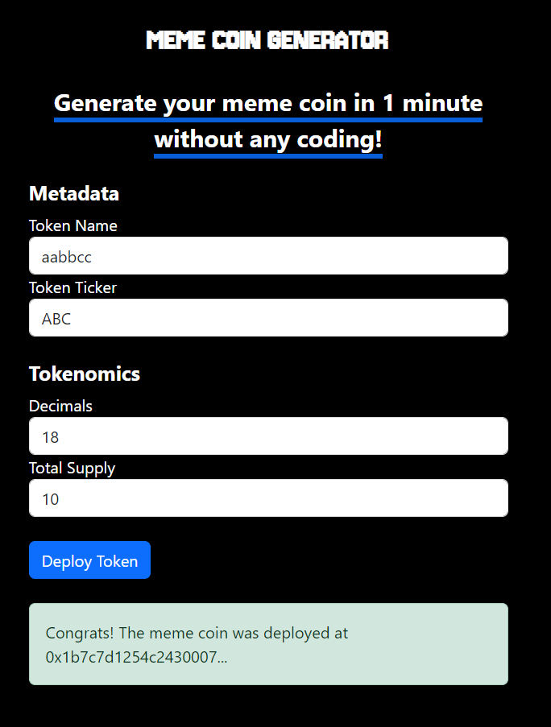

Use the [`Base Sepolia Testnet`](https://www.ethereum-ecosystem.com/faucets/base-sepolia) to get some test Ethereum.

## App

The app is deployed using Vercel on [`Meme Coin Generator`](https://meme-coin-generator.vercel.app/)

This is the front-end of the app

## Features

1. Create your first meme coin in under 1 minute
2. The contract verification is made automatically

This is a [Next.js](https://nextjs.org/) project bootstrapped with [`create-next-app`](https://github.com/vercel/next.js/tree/canary/packages/create-next-app).
